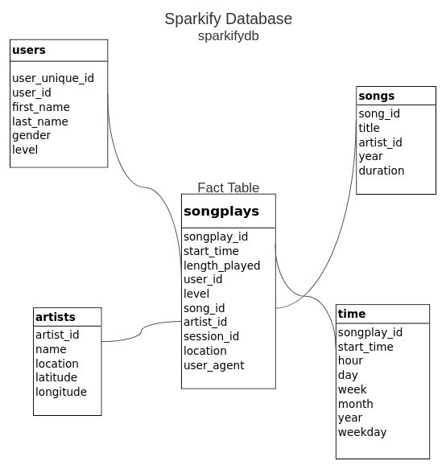

# Project: Data Warehouse
 
A music streaming startup, Sparkify, has grown their user base and song database and 
want to move their processes and data onto the cloud. Their data resides in S3, in a 
directory of JSON logs on user activity on the app, as well as a directory with JSON 
metadata on the songs in their app.

In order to help Sparkify to continue digital analytics smoothly despite rapid growth
of their customer and song database, I created a warehousing solution for data storage
which can keep their data organized and can make it easily accessible for reporting
and analytics.

1. Sparkify data were transferred from AWS/S3 into staging tables in Redshift, 
**staging_events_table** and **staging_songs_table**.
2. The proposed schema for the Warehouse is the **Star schema** 
 

- The **songplays** is the fact table.
- Dimension tables: **users**, **songs**, **artists**, **time**

## The implementation is designed to run in the following order.
All python scripts should be run in the **terminal window**. All empty fields in "dwh.cfg" file should be populated with relevant for your project values.

1.Create the Redshift cluster. A test connection will be established after the 
cluster is created. Note that sometimes a cluster might have status "Unavailable". 
If that happens, you'll see the error message. Please, rerun the script then.
```
python -m cluster_management
```

2.Create tables. All necessary tables will be created in this step.
```
python -m create_tables
```

3.The Extract-Transforme-Load (ETL). This step takes the longest time. Please, 
be patient.
```
python -m etl
```

4.Test the results. Please, execute all cells in the file `test.ipynb`. 

5.To **delete** the Redshift cluster, Please, execute the last cell in `test.ipynb`.